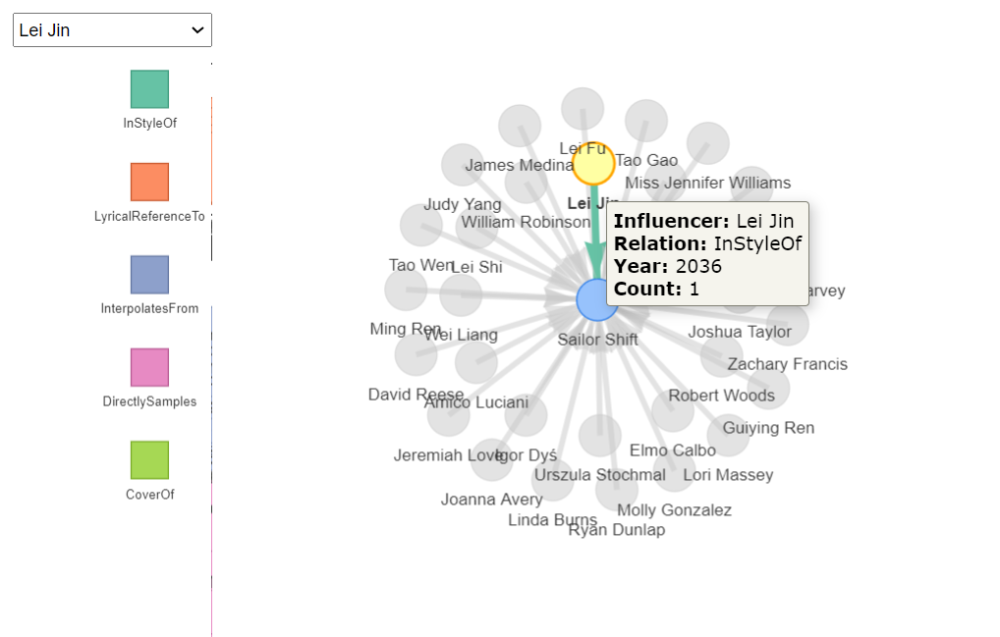

# 1 Overview

## 1.1 Background

One of music’s biggest superstars is Oceanus native Sailor Shift. From humble beginnings, Sailor has grown in popularity and now enjoys fans around the world. Sailor started her career on the island nation of Oceanus which can be clearly seen in her early work, she started in the genre of “Oceanus Folk”. While Sailor has moved away from the traditional Oceanus style, the Oceanus Folk has made a name for itself in the musical world. The popularity of this music is one of the factors driving an increase in tourism to a quiet island nation that used to be known for fishing.

In 2023, Sailor Shift joined the Ivy Echoes – an all-female Oceanus Folk band consisting of Sailor (vocalist), Maya Jensen (vocalist), Lila “Lilly” Hartman (guitarist), Jade Thompson (drummer), and Sophie Ramirez (bassist). They played together at venues throughout Oceanus but had broken up to pursue their individual careers by 2026. Sailor’s breakthrough came in 2028 when one of her singles went viral, launched to the top of the global charts (something no other Oceanus Folk song had ever done). Since then, she has only continued to grow in popularity worldwide.

Sailor has released a new album almost every year since her big break, and each has done better than the last. Although she has remained primarily a solo artist, she has also frequently collaborated with other established artists, especially in the Indie Pop and Indie Folk genres. She herself has branched out musically over the years but regularly returns to the Oceanus Folk genre — even as the genre’s influence on the rest of the music world has spread even more.

Sailor has always been passionate about two things: (1) spreading Oceanus Folk, and (2) helping lesser-known artists break into music. Because of those goals, she’s particularly famous for her frequent collaborations.

Additionally, because of Sailor’s success, more attention began to be paid over the years to her previous bandmates. All 4 have continued in the music industry—Maya as an independent vocalist, Lilly and Jade as instrumentalists in other bands, and Sophie as a music producer for a major record label. In various ways, all of them have contributed to the increased influence of Oceanus folk, resulting in a new generation of up-and-coming Oceanus Folk artists seeking to make a name for themselves in the music industry.

Now, as Sailor returns to Oceanus in 2040, a local journalist – Silas Reed – is writing a piece titled Oceanus Folk: Then-and-Now that aims to trace the rise of Sailor and the influence of Oceanus Folk on the rest of the music world. He has collected a large dataset of musical artists, producers, albums, songs, and influences and organized it into a knowledge graph. Your task is to help Silas create beautiful and informative visualizations of this data and uncover new and interesting information about Sailor’s past, her rise to stardom, and her influence.

## 1.2 Task and Question

1.  Design and develop visualizations and visual analytic tools that will allow Silas to explore and understand the profile of Sailor Shift’s career

a.Who has she been most influenced by over time?

b.Who has she collaborated with and directly or indirectly influenced?

c.How has she influenced collaborators of the broader Oceanus Folk community?

2.  Develop visualizations that illustrate how the influence of Oceanus Folk has spread through the musical world.

a.Was this influence intermittent or did it have a gradual rise?

b.What genres and top artists have been most influenced by Oceanus Folk?

c.On the converse, how has Oceanus Folk changed with the rise of Sailor Shift? From which genres does it draw most of its contemporary inspiration?

3.  Use your visualizations to develop a profile of what it means to be a rising star in the music industry.

a.Visualize the careers of three artists. Compare and contrast their rise in popularity and influence.

b.Using this characterization, give three predictions of who the next Oceanus Folk stars with be over the next five years.

# 2 Data description

## 2.1 Load packages

::: callout-note
# Install required packages if you haven't already

install.packages(c( "tidyverse", \# data wrangling & ggplot2 "jsonlite", \# JSON import "igraph", \# core graph algorithms "tidygraph", \# dplyr‐style graph manipulation "ggraph", \# ggplot2‐style graph plotting "lubridate", \# date parsing "scales", \# axis formatting "visNetwork", \# interactive network viz "plotly" \# interactive plots ))
:::

```{r library-loading, message=FALSE, warning=FALSE}
# Load libraries
library(tidyverse)
library(jsonlite)
library(igraph)
library(tidygraph)
library(ggraph)
library(lubridate)
library(scales)
library(visNetwork)
library(plotly)
library(igraph)
library(patchwork)
library(SmartEDA)
library(dplyr)
library(RColorBrewer)
```

| **Package** | **Description** |
|------------------------------------|------------------------------------|
| **tidyverse** | A meta-package that loads a suite of core data-science tools: ggplot2 for plotting; dplyr for data manipulation; tidyr for reshaping; readr for fast import; purrr for functional programming; stringr for string operations; and more. |
| **jsonlite** | High-performance JSON parser/generator. Use `fromJSON()` to read nested JSON into R lists or tibbles, and `toJSON()` to write R objects back to JSON. |
| **igraph** | Core graph/network library offering algorithms for shortest paths, centrality, community detection, edge/node operations, and more. |
| **tidygraph** | “Tidy” interface to igraph: lets you manipulate graphs with dplyr-style verbs (`activate()`, `filter()`, `mutate()`) while preserving graph structure. |
| **ggraph** | ggplot2 extension for graph plotting. Supports force-directed, circular, tree, Sankey layouts, and mapping node/edge aesthetics (size, color, shape) in a declarative grammar. |
| **lubridate** | Simplifies date-time parsing and arithmetic: use `ymd()`, `ymd_hms()`, extract components (year, month), handle time zones, and perform date math with intuitive functions. |
| **scales** | Formatting helpers for ggplot2 axes and legends: turn numbers into percentages, millions/k, format dates, control breaks and labels. |
| **visNetwork** | HTML-widget wrapping vis.js for interactive networks: pan, zoom, drag nodes, tooltips, and dynamic styling. Embeddable in RMarkdown or Shiny. |
| **plotly** | Converts ggplot2 (or raw plotly) graphs into interactive web plots with hover tooltips, zooming, 3D support, and legend toggling—ideal for exploratory analysis. |

## 2.2 Data structure

### 2.2.1 Data loading

The first step is to load the dataset into our environment and have a quick check of it:

```{r data-loading, message=FALSE, warning=FALSE}

# 1. Read in the graph JSON (flatten nested lists into columns)
graph_data <- fromJSON("MC1_graph.json", flatten = TRUE)

# 2. Quick check
str(graph_data)
```

### 2.2.2 Basic information generation

1.  Total nodes and total egdes:

```{r totals, message=FALSE, warning=FALSE}

nodes_df <- as_tibble(graph_data$nodes)
edges_df <- as_tibble(graph_data$links)

cat("Total nodes: ", nrow(nodes_df), "\n")
cat("Total edges: ", nrow(edges_df), "\n")
```

2.  Nodes and Edges type:

```{r types, message=FALSE, warning=FALSE}

# Count nodes by type
node_type_counts <- nodes_df %>%
  count(`Node Type`, sort = TRUE)
print(node_type_counts)

# Count edges by relationship
edge_type_counts <- edges_df %>%
  count(`Edge Type`, sort = TRUE)
print(edge_type_counts)
```

Let's make a simple plot to see the distribution of nodes and edges:

```{r types-plot, message=FALSE, warning=FALSE}
node_counts <- nodes_df %>%
  count(`Node Type`, name = "count_nodes")

edge_counts <- edges_df %>%
  count(`Edge Type`, name = "count_edges")

# Base ggplots with larger text
plot1 <- ggplot(node_counts, aes(
    x = reorder(`Node Type`, -count_nodes),
    y = count_nodes
  )) +
  geom_col(fill = "steelblue") +
  labs(
    title = "Counts by Type",
    x     = "Node Type",
    y     = "Count"
  ) +
  theme_minimal(base_size = 16)

plot2 <- ggplot(edge_counts, aes(
    x = reorder(`Edge Type`, -count_edges),
    y = count_edges
  )) +
  geom_col(fill = "forestgreen") +
  labs(
    title = "Counts by Type",
    x     = "Edge Type",
    y     = "Count"
  ) +
  theme_minimal(base_size = 16)


# 2) OR Interactive via Plotly
subplot(plot1, plot2, nrows = 2, shareX = FALSE, titleY = TRUE) %>%
  layout(
    xaxis = list(
      title      = "",      # remove x-axis title
      tickangle  = -45,
      tickfont   = list(size = 8),
      automargin = TRUE
    ),
    xaxis2 = list(
      title      = "",      # remove x-axis title on second plot
      tickangle  = -45,
      tickfont   = list(size = 8),
      automargin = TRUE
    ),
    yaxis = list(
      title = ""            # remove y-axis title
    ),
    yaxis2 = list(
      title = ""            # remove y-axis title on second plot
    ),
    margin = list(b = 100)
  )
```

### 2.2.3 Other information

1.  We are going to explore other information:

-   How many distinct genres?
-   How many “notable” nodes?
-   Distribution of release years for Songs

```{r others info, message=FALSE, warning=FALSE}
nodes_df %>% 
  distinct(genre) %>% 
  count() %>% 
  rename(n_genres = n) %>% 
  print()

nodes_df %>% 
  count(notable) %>% 
  print()

nodes_df %>% 
  filter(`Node Type` == "Song") %>%
  count(release_date, sort = TRUE) %>% 
  slice_head(n = 10) %>% 
  print()

```

2.  Generate then a graph to have an overview of nodes centrality:

```{r g, message=FALSE, warning=FALSE}

# 8. Build an igraph for basic centrality
#   – Prepare vertex IDs as character
nodes2 <- nodes_df %>% 
  mutate(id_chr   = as.character(id),
         label    = name) %>% 
  select(id_chr, label, everything(), -name, -id)

#   – Prepare edges with from/to
edges2 <- edges_df %>% 
  mutate(from = as.character(source),
         to   = as.character(target)) %>% 
  select(from, to, everything(), -source, -target, -key)

g <- graph_from_data_frame(d = edges2, vertices = nodes2, directed = TRUE)

# 9. Compute and show top 20 nodes by total degree
deg_tbl <- tibble(
  label        = V(g)$label,
  type         = V(g)$`Node.Type`,
  degree_in    = degree(g, mode = "in"),
  degree_out   = degree(g, mode = "out"),
  degree_total = degree(g, mode = "all")
)

deg_top20 <- deg_tbl %>%
  arrange(desc(degree_total)) %>%
  slice_head(n = 20)

plot_ly(
  data = deg_top20,
  x    = ~reorder(label, -degree_total),   # note the minus!
  y    = ~degree_total,
  type = 'bar',
  text = ~paste0(
    "Total: ", degree_total, "<br>",
    "In: ",    degree_in,    "<br>",
    "Out: ",   degree_out
  ),
  hoverinfo = 'text',
  marker    = list(color = 'steelblue')
) %>%
  layout(
    title = "Top 10 Nodes by Total Degree",
    xaxis = list(
      title     = "Node",
      tickangle = -45
    ),
    yaxis = list(title = "Degree"),
    margin = list(b = 120)
  )
```

# 3 Task 1

::: callout-note
Design and develop visualizations and visual analytic tools that will allow Silas to explore and understand the profile of Sailor Shift’s career

a.  Who has she been most influenced by over time?

b.  Who has she collaborated with and directly or indirectly influenced?

c.  How has she influenced collaborators of the broader Oceanus Folk community?
:::

## 3.1 Task 1 (a)

::: callout-note
a.  Who has she been most influenced by over time?
:::

To answer the question, let's first find Sailor's ID and all songs performed by her, then construct a kind of influence-edge table for analysis based on the prior influence proxies defined ("InStyleOf","LyricalReferenceTo","InterpolatesFrom","DirectlySamples","CoverOf"):

```{r task 1.1, message=FALSE, warning=FALSE}
# 1. Load graph
g      <- fromJSON("MC1_graph.json")
nodes  <- g$nodes
edges  <- g$links

# 2. Sailor Shift’s songs
sailor_id    <- nodes %>%
  filter(`Node Type`=="Person", name=="Sailor Shift") %>%
  pull(id)
sailor_songs <- edges %>%
  filter(`Edge Type`=="PerformerOf", source==sailor_id) %>%
  pull(target)

# 3. Build influence‐edges table
wanted_types <- c("InStyleOf","LyricalReferenceTo",
                  "InterpolatesFrom","DirectlySamples","CoverOf")
infl_edges <- edges %>%
  filter(`Edge Type` %in% wanted_types,
         source %in% sailor_songs) %>%
  transmute(
    song_id   = source,
    infl_song = target,
    rel_type  = `Edge Type`
  ) %>%
  left_join(
    nodes %>% filter(`Node Type`=="Song") %>%
      transmute(song_id = id, year = as.integer(release_date)),
    by="song_id"
  ) %>%
  left_join(
    edges %>% filter(`Edge Type`=="PerformerOf") %>%
      transmute(infl_song = target, performer = source),
    by="infl_song"
  ) %>%
  left_join(
    nodes %>% filter(`Node Type`=="Person") %>%
      transmute(performer = id, influencer = name),
    by="performer"
  ) %>%
  filter(!is.na(influencer), !is.na(year))

infl_edges
```

Once we have summary of influence type and year, let's define key elements for visualization task, which include node and edges dataframes: 

```{r task 1.2, message=FALSE, warning=FALSE}

# 4. Count per influencer‐year‐type
evt_all <- infl_edges %>%
  count(influencer, year, rel_type, name="weight")

# 5. Select all years (default)
selected_years <- sort(unique(evt_all$year))

# 6. Filter events by selected_years
evt <- evt_all %>%
  filter(year %in% selected_years)

# 7. Build node_df
infs    <- sort(unique(evt$influencer))
node_df <- data.frame(
  id    = seq_len(length(infs)+1),
  label = c("Sailor Shift", infs),
  group = c("Artist", rep("Influencer", length(infs))),
  stringsAsFactors = FALSE
)

# 8. Color palette for relation types
type_cols <- setNames(
  brewer.pal(length(wanted_types), "Set2"),
  wanted_types
)

# 9. Build edge_df from filtered evt
edge_df <- evt %>%
  rowwise() %>%
  transmute(
    from   = match(influencer, node_df$label),
    to     = 1,
    value  = weight,
    color  = list(color = type_cols[rel_type]),
    title  = paste0(
      "<b>Influencer:</b> ", influencer,
      "<br><b>Relation:</b> ", rel_type,
      "<br><b>Year:</b> ", year,
      "<br><b>Count:</b> ", weight
    )
  ) %>%
  ungroup()

node_df
edge_df
```

Now we are going to make an interactive to show the relationship between Sailor and her influencer, the interactive function is shown as in the following immagine, so when we filter on a specific influencer and move on the edge, we can see the type of relation and year of influence: 

Code to plot is the following:
```{r task 1.3, message=FALSE, warning=FALSE}

# 10. Render interactive network
visNetwork(node_df, edge_df, height="600px", width="100%") %>%
  visNodes(shape="dot", size=20, font=list(size=16)) %>%
  visEdges(arrows="to", scaling=list(min=1, max=10), smooth=FALSE) %>%
  visOptions(
    highlightNearest = list(enabled=TRUE, degree=1, hover=TRUE),
    nodesIdSelection = TRUE
  ) %>%
  visLegend(
    useGroups = FALSE,
    addNodes  = data.frame(
      label = wanted_types,
      shape = "square",
      color = type_cols
    )
  ) %>%
  visLayout(randomSeed = 42)
```

To see the influence trend, we can generate an interactive bar chart which include all relation type and year information for a deeper analysis:  

```{r task 1.4, message=FALSE, warning=FALSE}

# Summarise total influence events per year and relation type
year_type_summary <- evt %>%
  group_by(year, rel_type) %>%
  summarise(total_events = sum(weight), .groups = "drop") %>%
  arrange(year, rel_type)

# Also calculate total events per year (for trend line)
year_total_summary <- year_type_summary %>%
  group_by(year) %>%
  summarise(total = sum(total_events), .groups = "drop")

# Interactive stacked bar chart with trend line
plot_ly() %>%
  add_trace(
    data  = year_type_summary,
    x     = ~year,
    y     = ~total_events,
    color = ~rel_type,
    type  = 'bar',
    hoverinfo = 'text',
    text  = ~paste0(
      "<b>Year:</b> ", year,
      "<br><b>Type:</b> ", rel_type,
      "<br><b>Events:</b> ", total_events
    )
  ) %>%
  add_trace(
    data = year_total_summary,
    x    = ~year,
    y    = ~total,
    type = 'scatter',
    mode = 'lines+markers',
    name = 'Total Trend',
    line = list(color = 'black', width = 2),
    marker = list(color = 'black', size = 5),
    hoverinfo = 'text',
    text = ~paste0(
      "<b>Year:</b> ", year,
      "<br><b>Total Events:</b> ", total
    )
  ) %>%
  layout(
    title   = "Influence Events by Relation Type Over Years",
    xaxis   = list(title = "Release Year"),
    yaxis   = list(title = "Number of Events"),
    barmode = "stack",
    legend  = list(title = list(text = "<b>Relation Type</b>"))
  )
```

::: callout-note
Based on the previous plots, we can clearly observe the significant influence of other artists (such as Lei Fu and Lei Jin) on Sailor Shift’s musical style over the years. The most prominent forms of influence include InStyleOf, InterpolatesFrom, and CoverOf. Key moments of influence occurred in 2028 and 2036, with stylistic and homage-based connections dominating the earlier years.

Over time, Sailor Shift’s influences evolved from stylistic inspirations to more direct forms, such as interpolation and sampling, reflecting a shift toward deeper integration of external musical elements into her work.
:::

## 3.2 Task 1 (b)

::: callout-note
b.  Who has she collaborated with and directly or indirectly influenced?
:::

```{r task1.3_network, message=FALSE, warning=FALSE}

# 3) Collaborators
collab_types  <- c("PerformerOf","ComposerOf","LyricistOf","ProducerOf","RecordedBy")
collab_ids    <- edges %>%
  filter(`Edge Type` %in% collab_types, target %in% sailor_songs) %>%
  pull(source) %>% unique() %>% setdiff(sailor_id)
collaborators <- nodes %>%
  filter(id %in% collab_ids, `Node Type`=="Person") %>%
  pull(name)

# 4) Direct influences
influence_types   <- c("InStyleOf","InterpolatesFrom","LyricalReferenceTo","DirectlySamples","CoverOf")
direct_song_ids   <- unique(c(
  edges %>% filter(`Edge Type` %in% influence_types, source %in% sailor_songs) %>% pull(target),
  edges %>% filter(`Edge Type` %in% influence_types, target %in% sailor_songs) %>% pull(source)
))
direct_ids        <- edges %>% 
  filter(`Edge Type`=="PerformerOf", target %in% direct_song_ids) %>% 
  pull(source) %>% unique() %>% setdiff(sailor_id)
direct_influenced <- nodes %>% 
  filter(id %in% direct_ids, `Node Type`=="Person") %>% 
  pull(name)

# 5) Indirect influences (two‐hop), with orphan fallback
# a) find all two‐hop song links
second_edges <- edges %>%
  filter(`Edge Type` %in% influence_types, target %in% direct_song_ids) %>%
  transmute(indirect_song = source, direct_song = target)

# b) map song → performer
perf_map <- edges %>%
  filter(`Edge Type`=="PerformerOf") %>%
  transmute(song_id = target, performer_id = source) %>%
  left_join(
    nodes %>% filter(`Node Type`=="Person") %>%
      transmute(performer_id = id, performer_name = name),
    by = "performer_id"
  )

# c) build indirect links, marking orphans
indirect_links <- second_edges %>%
  # attach direct performer (may be NA)
  left_join(perf_map, by = c("direct_song" = "song_id")) %>%
  rename(direct_perf_id   = performer_id, 
         direct_perf_name = performer_name) %>%
  # attach indirect performer
  left_join(perf_map, by = c("indirect_song" = "song_id")) %>%
  rename(indir_perf_id    = performer_id, 
         indirect_perf_name = performer_name) %>%
  filter(!is.na(indirect_perf_name) & indirect_perf_name != "Sailor Shift") %>%
  transmute(
    # if no direct performer, link back to Sailor Shift
    direct_perf_name   = ifelse(is.na(direct_perf_name), "Sailor Shift", direct_perf_name),
    indirect_perf_name,
    rel = ifelse(is.na(direct_perf_name),
                 "Orphan Indirect Influence",
                 "Indirect Influence")
  ) %>%
  distinct()

indirect_influenced <- unique(indirect_links$indirect_perf_name)

# 6) Build nodes_df
labels <- c("Sailor Shift", collaborators, direct_influenced, indirect_influenced)
groups <- c(
  "Sailor Shift",
  rep("Collaborator",       length(collaborators)),
  rep("Direct Influence",   length(direct_influenced)),
  rep("Indirect Influence", length(indirect_influenced))
)
nodes_df <- data.frame(
  id    = seq_along(labels),
  label = labels,
  group = groups,
  stringsAsFactors = FALSE
)

# 7) Build edges_df
edge_list <- list()

# collaboration → Sailor Shift
if(length(collaborators)>0) {
  edge_list$collab <- data.frame(
    from = match(collaborators,       nodes_df$label),
    to   = 1,
    rel  = "Collaboration",
    stringsAsFactors = FALSE
  )
}

# Sailor Shift → direct influences
if(length(direct_influenced)>0) {
  edge_list$direct <- data.frame(
    from = 1,
    to   = match(direct_influenced,   nodes_df$label),
    rel  = "Direct Influence",
    stringsAsFactors = FALSE
  )
}

# direct → indirect (or orphan back to Sailor Shift)
if(nrow(indirect_links)>0) {
  edge_list$indirect <- indirect_links %>%
    transmute(
      from = match(direct_perf_name,   nodes_df$label),
      to   = match(indirect_perf_name, nodes_df$label),
      rel
    )
}

edges_df <- bind_rows(edge_list)

# 8) Assign edge colors + titles
rel_colors <- c(
  "Collaboration"             = "#1f78b4",
  "Direct Influence"          = "#33a02c",
  "Indirect Influence"        = "#fb9a99",
  "Orphan Indirect Influence" = "#ff7f00"
)
edges_df <- edges_df %>%
  mutate(
    color = lapply(rel, function(r) list(color = rel_colors[r])),
    title = paste0("<b>Relation:</b> ", rel),
    value = 2
  )

# 9) Render
visNetwork(nodes_df, edges_df, height="600px", width="100%") %>%
  visNodes(shape="dot", size=20, font=list(size=14)) %>%
  visEdges(arrows="to", smooth=FALSE) %>%
  visOptions(
    highlightNearest = list(enabled=TRUE, degree=1, hover=TRUE),
    nodesIdSelection = TRUE
  ) %>%
  visLegend(
    useGroups = FALSE,
    addNodes  = data.frame(
      label = names(rel_colors),
      shape = "square",
      color = unname(rel_colors)
    )
  ) %>%
  visLayout(randomSeed = 42)
```

::: callout-note
:::

## 3.3 Task 1 (c)


```{r task1.4_oceanus_network_final, message=FALSE, warning=FALSE}

# Load the JSON graph data
graph_data <- fromJSON("MC1_graph.json")
# Nodes and Edges to dataframes
nodes_df <- as_tibble(graph_data$nodes)
edges_df <- as_tibble(graph_data$links)

# Explicitly check for NA in critical columns
sum(is.na(nodes_df$id))       # Should be 0
sum(is.na(edges_df$source))   # Should be 0
sum(is.na(edges_df$target))   # Should be 0

nodes_df <- nodes_df %>% drop_na(id)
edges_df <- edges_df %>% drop_na(source, target)

# Sailor Shift ID
sailor_shift_id <- nodes_df %>% filter(name == "Sailor Shift") %>% pull(id)

# Oceanus Folk Songs
oceanus_songs_ids <- nodes_df %>% 
  filter(genre == "Oceanus Folk") %>% pull(id)

# Collaborators in Oceanus Folk community (any person who performed/composed Oceanus Folk songs)
oceanus_collaborators <- edges_df %>%
  filter(target %in% oceanus_songs_ids) %>%
  pull(source) %>%
  unique()

# Sailor Shift's direct connections through all edges
direct_connections <- edges_df %>% 
  filter(source == sailor_shift_id) %>% 
  pull(target) %>% 
  unique()

# Direct influenced collaborators
direct_influenced_collabs <- intersect(oceanus_collaborators, direct_connections)

# Nodes indirectly influenced by Sailor Shift (via any edge)
indirect_connections <- edges_df %>% 
  filter(source %in% direct_connections) %>% 
  pull(target) %>% 
  unique()

# Indirect influenced collaborators
indirect_influenced_collabs <- intersect(oceanus_collaborators, indirect_connections)

all_influenced_collabs <- union(direct_influenced_collabs, indirect_influenced_collabs)

# Collaborator names explicitly
collab_names <- nodes_df %>% 
  filter(id %in% all_influenced_collabs) %>% 
  pull(name)

print(collab_names)

# Nodes involved: Sailor Shift + influenced collaborators
visual_nodes <- nodes_df %>% 
  filter(id %in% c(sailor_shift_id, all_influenced_collabs)) %>%
  mutate(label = if_else(id == sailor_shift_id, "Sailor Shift", name))

# Edges connecting visual nodes (all edge types)
visual_edges <- edges_df %>%
  filter(source %in% visual_nodes$id, target %in% visual_nodes$id)

# Reindex safely for tidygraph
# Nodes for visualization
visual_nodes <- nodes_df %>% 
  filter(id %in% c(sailor_shift_id, all_influenced_collabs)) %>%
  mutate(label = if_else(id == sailor_shift_id, "Sailor Shift", name),
         group = if_else(id == sailor_shift_id, "Sailor Shift", "Collaborators"))

# Edges connecting these nodes
visual_edges <- edges_df %>%
  filter(source %in% visual_nodes$id, target %in% visual_nodes$id) %>%
  rename(from = source, to = target) %>%
  select(from, to, label = `Edge Type`)

# Build the interactive graph
visNetwork(visual_nodes, visual_edges, width = "100%", height = "600px") %>%
  visNodes(shape = "dot", size = 15, font = list(size = 16)) %>%
  visEdges(arrows = "to", smooth = TRUE) %>%
  visGroups(groupname = "Sailor Shift", color = "orange") %>%
  visGroups(groupname = "Collaborators", color = "skyblue") %>%
  visLegend() %>%
  visOptions(highlightNearest = TRUE, nodesIdSelection = TRUE) %>%
  visPhysics(stabilization = TRUE)

```
