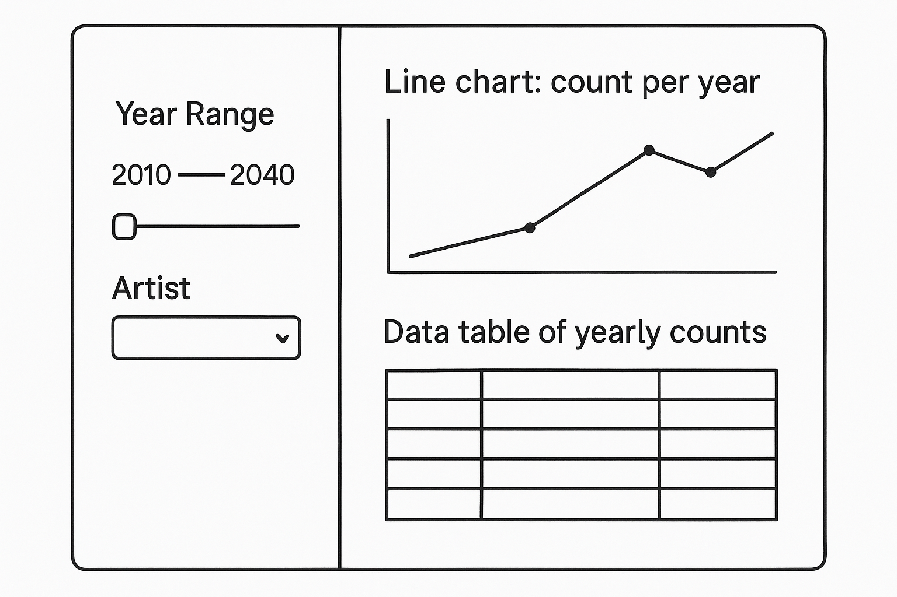
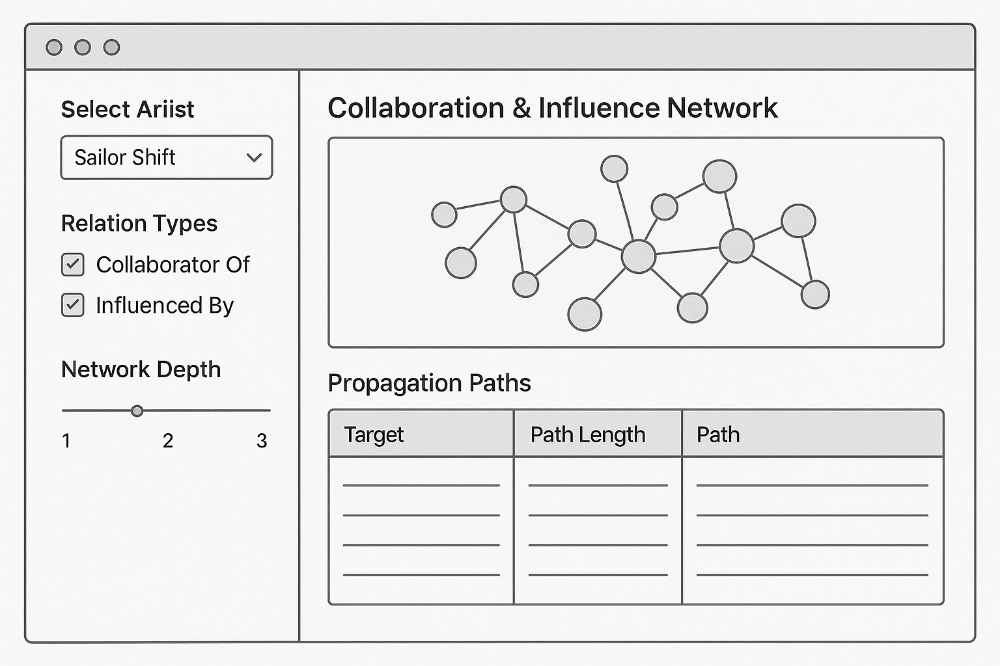
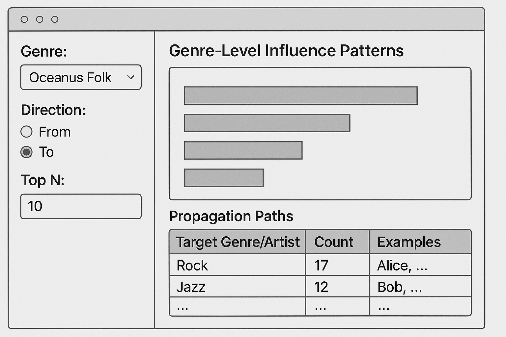

# 0 Packages check

This section ensures that all required R packages are available for the analysis and interactive modules in this project.

```{r}
packages <- c(
  "shiny", "shinydashboard",
  "jsonlite", "igraph", "ggraph",
  "dplyr", "lubridate",
  "plotly", "visNetwork", "DT",
  "leaflet", "ggridges", "ggmosaic"
)
installed <- rownames(installed.packages())
for (pkg in packages) {
  if (!pkg %in% installed) install.packages(pkg)
  library(pkg, character.only = TRUE)
}
```

# 1 Data Preparation & Testing

We load your knowledge‐graph JSON, clean it into tidy node and edge tables, and build an igraph for global metrics.

```{r}
library(jsonlite)
library(tibble)
library(dplyr)
library(lubridate)
library(igraph)

# Load JSON
raw_json <- fromJSON("MC1_graph.json")

# Helper: Parse "YYYY" or "YYYY-MM-DD"
parse_date <- function(x) {
  x <- as.character(x)
  x[x == ""] <- NA
  year_only <- !is.na(x) & grepl("^\\d{4}$", x)
  x[year_only] <- paste0(x[year_only], "-01-01")
  ymd(x)
}

# Clean nodes
g_nodes_df <- as_tibble(raw_json$nodes) %>%
  rename(
    id        = id,
    label     = name,
    node_type = `Node Type`
  ) %>%
  mutate(
    id           = as.character(id),
    release_date = parse_date(release_date),
    written_date = if ("written_date" %in% names(.)) parse_date(written_date) else as.Date(NA)
  )

# Clean edges
g_edges_df <- as_tibble(raw_json$links) %>%
  rename(
    from_id  = source,
    to_id    = target,
    relation = `Edge Type`
  ) %>%
  mutate(
    from_id = as.character(from_id),
    to_id   = as.character(to_id)
  )

# Build igraph
g_all <- graph_from_data_frame(
  d = g_edges_df %>%
    transmute(from = from_id, to = to_id, relation),
  vertices = g_nodes_df %>%
    transmute(name = id, label, node_type),
  directed = TRUE
)

# Sanity checks
stopifnot(
  nrow(g_nodes_df) > 0,
  nrow(g_edges_df) > 0,
  all(c("id", "label", "node_type") %in% names(g_nodes_df)),
  all(c("from_id", "to_id", "relation") %in% names(g_edges_df))
)

print(g_all)
```

# 2 Module 1: Influence Over Time

Tasks & Questions:

-   Who has Sailor been most influenced by over time?

-   Was influence intermittent or gradual?

## 2.1 Input & Output Definitions

| Input ID | Widget | Choices / Default | Purpose |
|----|----|----|----|
| `yearRange` | sliderInput | 2010–2040; default c(2010,2040) | Filter by written_date year |
| `artist1` | selectInput | `nodes_df$name`; default “Sailor Shift” | Choose focal artist |

| Output ID | Render         | Description                 |
|-----------|----------------|-----------------------------|
| `tsPlot`  | renderPlotly() | Line chart: count per year  |
| `tsTable` | renderDT()     | Data table of yearly counts |

## 2.2 Code Preparation & Testing

Before wiring up the Shiny module, we encapsulate our data-manipulation steps into a reusable function and verify its basic behavior:

```{r}
library(dplyr)
library(lubridate)

# 1. Join `written_date` into edges from target node (the influenced song)
edges_labeled <- g_edges_df %>%
  left_join(
    g_nodes_df %>% select(id, label, written_date),
    by = c("to_id" = "id")
  ) %>%
  rename(to_label = label)

# 2. Define helper function to compute yearly influence counts for a specific artist
get_influence_over_time <- function(artist = "Sailor Shift", yearRange = c(2010, 2040)) {
  edges_labeled %>%
    filter(
      to_label == artist,
      !is.na(written_date),
      between(year(written_date), yearRange[1], yearRange[2])
    ) %>%
    count(year = year(written_date), name = "num_influences")
}

# 3. Structural test to confirm correct output format
test_df <- get_influence_over_time()
stopifnot(
  tibble::is_tibble(test_df),
  all(c("year", "num_influences") %in% names(test_df))
)

# 4. Sanity check using a real artist found in the data
example_artist <- edges_labeled %>%
  filter(!is.na(written_date)) %>%
  slice(1) %>%
  pull(to_label)

if (length(example_artist) > 0) {
  example_df <- get_influence_over_time(artist = example_artist, yearRange = c(2000, 2050))
  stopifnot(
    tibble::is_tibble(example_df),
    all(c("year", "num_influences") %in% names(example_df))
  )
}

print(test_df)
print(example_artist)
```

## 2.3 UI Storyboard

Below is a wireframe for Module 1: Influence Over Time. It shows how users will interact with the controls and view the results:

### Sidebar

| Input ID | Widget | Choices / Default | Description |
|----|----|----|----|
| yearRange | sliderInput | 2010–2040; default full | Allows user to select a year range for analysis. |
| artist1 | selectInput | Artist list; default = Sailor Shift | Dropdown menu to choose the focal artist for the analysis. |

### Main Panel

| Output ID | Render | Description |
|----|----|----|
| tsPlot | renderPlotly() | Interactive line chart showing the number of influences per year. Hover for counts; zoom/pan enabled. |
| tsTable | renderDT() | Data table of `[year, num_influences]`, with sorting, pagination, and search functionality. |



::: callout-note
User flow:

1.  Pick a subset of years via the slider.

2.  Select an artist to focus on.

3.  Instantly see how many influence-edges point to them each year, both in chart and table form.

4.  Explore whether influence arrives in bursts (intermittent) or builds gradually over time.
:::

# 3 Module 2: Collaboration Network & Propagation

Tasks & Questions:

-   Who has Sailor collaborated with, and whom has she influenced (directly/indirectly)?

-   How has influence propagate through her songs and collaborators?

## 3.1 Input & Output Definitions

| Input ID | Widget | Choices / Default | Purpose |
|----|----|----|----|
| `artist2` | selectInput | `nodes_df$label`; default “Sailor Shift” | Choose the focal artist for the network |
| `relationTypes` | checkboxGroupInput | c("CollaboratorOf", "InfluencedBy") | Select which edge types to include (collaborations vs. influences) |
| `networkDepth` | sliderInput | 1–3; default 1 | How many hops (degrees of separation) to traverse from the focal artist |

| Output ID | Render | Description |
|----|----|----|
| `networkPlot` | renderPlotly() | Interactive network graph showing nodes and edges for the selected artist |
| `propTable` | renderDT() | Data table listing each connected node, relation type, and shortest path |

## 3.2 Code Preparation & Testing

This section defines how the filtered ego-network is built from the full graph g_all, and how the propagation paths are traced through shortest path calculations:

```{r}
# — 1. Build a filtered ego‐network around the chosen artist —
get_collab_influence_graph <- function(artist    = "Sailor Shift",
                                       rel_types = c("CollaboratorOf", "InfluencedBy"),
                                       depth     = 1) {
  # Ensure the human-readable label exists
  if (is.null(V(g_all)$label)) {
    stop("Vertex attribute 'label' is missing from g_all.")
  }
  
  # 1a) Keep only edges of the selected types
  g_filt <- subgraph.edges(
    g_all,
    E(g_all)[E(g_all)$relation %in% rel_types],
    delete.vertices = FALSE
  )
  
  # 1b) Find the vertex index of the focal artist
  vid <- which(V(g_filt)$label == artist)
  if (length(vid) == 0) {
    stop(sprintf("Artist '%s' not found in the graph.", artist))
  }
  
  # 1c) Gather all vertices within `depth` hops
  vs <- ego(
    graph = g_filt,
    order = depth,
    nodes = vid,
    mode = "all"
  )[[1]]
  
  # 1d) Return the induced subgraph
  induced_subgraph(g_filt, vids = vs)
}

# — 2. Build propagation paths table —
get_propagation_table <- function(sub_g, artist = "Sailor Shift") {
  # Locate the starting vertex
  vid <- which(V(sub_g)$label == artist)
  if (length(vid) == 0) {
    stop(sprintf("Artist '%s' not in the subgraph.", artist))
  }
  
  # Compute shortest paths from the artist to every node
  paths <- shortest_paths(
    graph = sub_g,
    from  = vid,
    to    = V(sub_g),
    mode  = "all"
  )$vpath
  
  # Build a tibble: target, path length, and the full path string
  tibble(
    target      = sapply(paths, function(p) V(sub_g)$label[tail(p,1)]),
    path_length = sapply(paths, length) - 1,
    path        = sapply(paths, function(p)
                      paste(V(sub_g)$label[p], collapse = " → "))
  )
}

# — 3. Structural tests — 
test_graph <- get_collab_influence_graph()
stopifnot(inherits(test_graph, "igraph"))
stopifnot("Sailor Shift" %in% V(test_graph)$label)

test_table <- get_propagation_table(test_graph)
stopifnot(
  tibble::is_tibble(test_table),
  all(c("target","path_length","path") %in% names(test_table))
)
print(test_graph)
print(test_table)
```

## 3.3 UI Storyboard

### Left Sidebar – User Controls

| Input ID | Widget | Choices / Default | Description |
|----|----|----|----|
| artist_focus | selectInput | Artist list; default = Sailor Shift | Dropdown to select the focal artist for network exploration (`nodes_df$label`). |
| edge_types | checkboxGroupInput | CollaboratorOf, InfluencedBy; default = both checked | Checkboxes to include/exclude collaboration and/or influence edges in the network display. |
| max_depth | sliderInput | 1–3; default = 1 | Slider to control the maximum degrees (“hops”) from the focal artist to traverse in the network. |

### Main Panel – Outputs

| Output ID | Render | Description |
|----|----|----|
| artistGraph | renderPlotly() or visNetworkOutput() | Interactive network graph: nodes represent artists or songs; edges styled by type (dotted = influence, solid = collaboration). Tooltips show name/type. |
| pathTable | renderDT() | Data table listing each reachable node (Target), the path length from the focal artist, and the full propagation path. |



::: callout-note
User flow:

1.  Select a focal artist from the dropdown list.

2.  Choose the type(s) of relationships to explore: collaboration, influence, or both.

3.  Adjust the network depth slider to reveal 1–3 degrees of connections.

4.  Instantly view an interactive graph of connected artists and songs.

5.  Examine the data table to trace influence and collaboration paths, including how far and through whom influence propagates.

6.  Use this information to uncover direct vs. indirect influence patterns and how Sailor Shift’s reach spreads across the network.
:::

# 4 Module 3: Genre-Level Influence Patterns

Tasks & Questions:

-   Which genres and top artists have been most influenced by Oceanus Folk?

-   Which genres or artists has Oceanus Folk drawn inspiration from?

## 4.1 Input & Output Definitions

| Input ID | Widget | Choices / Default | Purpose |
|----|----|----|----|
| `genre_focus` | selectInput | Genre list; default = Oceanus Folk | Choose the genre to analyze (starting with Oceanus Folk) |
| `influenceDir` | radioButtons | `c("From", "To")` | Direction of influence: from genre to others, or others to this genre |
| `topN` | numericInput | default = 10 | Limit number of top genres/artists shown in bar chart & table |

| Output ID | Render | Description |
|----|----|----|
| `genreBarPlot` | renderPlotly() | Horizontal bar plot of top genres/artists influenced or influencing |
| `genreTable` | renderDT() | Data table showing genre interactions: target, count, and example artists |

## 4.2 Code Preparation & Testing

We’ll use edge metadata (like Edge Type = InfluencedBy) and node genres to build an influence matrix between genres. Here’s a proposed structure for this:

```{r}
library(dplyr)
library(tibble)

# 1) Filter only influence‐type edges
influence_edges <- edges_labeled %>%
  filter(relation %in% c(
    "InStyleOf", "LyricalReferenceTo",
    "InterpolatesFrom", "DirectlySamples", "CoverOf"
  ))

# 2) Attach genres for source and target nodes
infl_ext <- influence_edges %>%
  left_join(
    g_nodes_df %>% select(id, genre) %>% rename(source_genre = genre),
    by = c("from_id" = "id")
  ) %>%
  left_join(
    g_nodes_df %>% select(id, genre) %>% rename(target_genre = genre),
    by = c("to_id" = "id")
  )

# 3) Compute summary by focus_genre and direction
get_genre_influence_data <- function(
  focus_genre = "Oceanus Folk",
  direction   = "From",
  topN        = 10
) {
  # Choose source vs. target based on direction
  if (direction == "From") {
    df <- infl_ext %>% filter(source_genre == focus_genre)
    group_col <- sym("target_genre")
    artist_col <- sym("to_id")
  } else {
    df <- infl_ext %>% filter(target_genre == focus_genre)
    group_col <- sym("source_genre")
    artist_col <- sym("from_id")
  }
  
  df %>%
    filter(!is.na(!!group_col)) %>%
    group_by(genre = !!group_col) %>%
    summarise(
      influence_count = n(),
      example_artists = paste(
        unique(g_nodes_df$label[match(!!artist_col, g_nodes_df$id)])[1:5],
        collapse = "; "
      ),
      .groups = "drop"
    ) %>%
    arrange(desc(influence_count)) %>%
    slice_head(n = topN)
}

# 4) Sanity check
test_from <- get_genre_influence_data("Oceanus Folk", "From", 5)
stopifnot(
  nrow(test_from) <= 5,
  all(c("genre", "influence_count", "example_artists") %in% names(test_from))
)

print(test_from)
```

## 4.3 UI Storyboard

### Sidebar – User Controls (Inputs)

| UI Element | Type | Description |
|----|----|----|
| **Genre Selector** | `selectInput` | Dropdown list of all genres (default: Oceanus Folk). Allows the user to pick a genre as the focal point for analysis. |
| **Direction Radio** | `radioButtons` | Two choices: “From” (genres/artists influenced by selected genre), “To” (genres/artists that influence selected genre). |
| **Top N Numeric** | `numericInput` | User sets the number (N) of top genres/artists to show in the outputs (default 10, min 1, max 30). |

### Main Panel – Outputs

| UI Element | Type | Description |
|----|----|----|
| **Genre Bar Plot** | `renderPlotly()` | Interactive horizontal bar chart: shows the top N genres (and, optionally, key artists) most influenced by or influencing the focal genre. |
| **Genre Table** | `renderDT()` | Data table: shows detailed genre-genre links (genre name, influence count, and example artists), sortable and searchable. |



::: callout-note
User flow:

1.  User opens the module. By default, Oceanus Folk is selected as the focal genre, “From” direction is chosen, and the top 10 results are displayed.
2.  User changes the genre to “Electro Pop.” The bar plot and table instantly update to show genres influenced by Electro Pop (or that influence Electro Pop, depending on direction).
3.  User toggles direction from “From” to “To,” revealing genres that have influenced the currently selected genre.
4.  User adjusts the Top N to 20, revealing more connections in both the bar plot and the data table.
5.  User explores the bar plot, hovering over bars to view example artists.
6.  User scans/sorts the table, quickly identifying which genres and artists are most involved in cross-genre influence with the selected focal genre.
:::

# References

## References

-   Chang, W., Cheng, J., Allaire, J., Xie, Y., & McPherson, J. (2023). shiny: Web Application Framework for R. R package version 1.8.0. https://CRAN.R-project.org/package=shiny

-   Wickham, H., François, R., Henry, L., & Müller, K. (2023). dplyr: A Grammar of Data Manipulation. R package version 1.1.4. https://CRAN.R-project.org/package=dplyr

-   Sievert, C. (2020). plotly: Create Interactive Web Graphics via ‘plotly.js’. R package version 4.10.3. https://CRAN.R-project.org/package=plotly

-   Xie, Y., Cheng, J., & Tan, X. (2023). DT: A Wrapper of the JavaScript Library ‘DataTables’. R package version 0.31. https://CRAN.R-project.org/package=DT

## Data Source

-   Project dataset: MC1_graph.json (provided as part of ISSS608 course materials, 2025).

## AI Tools

-   OpenAI. (2024–2025). ChatGPT (GPT-4o model) for code explanation, report drafting, and technical writing assistance.
